# Watchdog — Architecture

> **Environmental early warning for urban streams.** Weather forecasts, 30-second walker reports and human judgement, joined in one auditable loop that ends in a standards-based hand-off to health services.

| | |
| --- | --- |
| **Rules** | v1.0.0 · `7a91bf2` (`rules/v1.0.0.json`) |
| **AI prompt** | `advisory-v2` (drafting only) |
| **Schema** | migrations `0001_init`, `0002_photos` |
| **Runtime** | Next.js 15 (App Router) · React 19 · TypeScript · Node 20+ |
| **Data** | libSQL — Turso in production, SQLite file locally |
| **Interop** | HL7 FHIR R4 transaction bundles |
| **Status** | Demo sandboxes: complete and tested · Permanent live workspace with staff sign-in: planned ([§25](#25-limitations-and-roadmap)) |
| **Updated** | 26 Sep 2026 |

## Contents

1. [Principles](#1-principles)
2. [Architecture at a glance](#2-architecture-at-a-glance)
3. [System context](#3-system-context)
4. [Containers](#4-containers)
5. [Deployment](#5-deployment)
6. [Directory map](#6-directory-map)
7. [Domain model](#7-domain-model)
8. [Scoring engine](#8-scoring-engine)
9. [Lifecycles](#9-lifecycles)
10. [Command pipeline](#10-command-pipeline)
11. [Client sync engine](#11-client-sync-engine)
12. [Workspaces and the replay clock](#12-workspaces-and-the-replay-clock)
13. [Persistence](#13-persistence)
14. [HTTP API](#14-http-api)
15. [AI drafting](#15-ai-drafting)
16. [FHIR interoperability](#16-fhir-interoperability)
17. [Weather and hydrology](#17-weather-and-hydrology)
18. [Photos, privacy and retention](#18-photos-privacy-and-retention)
19. [Security](#19-security)
20. [Reliability and performance](#20-reliability-and-performance)
21. [Scheduled jobs](#21-scheduled-jobs)
22. [Testing and CI](#22-testing-and-ci)
23. [Configuration](#23-configuration)
24. [Architecture decisions](#24-architecture-decisions)
25. [Limitations and roadmap](#25-limitations-and-roadmap)
26. [Glossary](#26-glossary)

---

## 1. Principles

| # | Principle | What it means in the code |
| --- | --- | --- |
| P1 | **Deterministic core** | `lib/engine.ts` and `lib/sim.ts` never read a clock, the network or randomness. Same inputs → same state, byte for byte (self-tests T15, T16). |
| P2 | **One reducer, two places** | The browser reduces for an instant UI; the server runs the *same* reducer inside a transaction and is authoritative. No second implementation to drift. |
| P3 | **Human gate** | No public text and no health-system hand-off happen without a coordinator's action. The server re-checks the guardrails at publish. |
| P4 | **AI writes words, never decisions** | The model drafts advisory text from a name-free brief. It cannot score, open signals, publish or see anything a member of the public typed. |
| P5 | **Explicit outside calls** | Weather imports, AI drafts and FHIR sends happen only on a person's action or a scheduled job — never as a side effect of reading a page. |
| P6 | **Privacy by construction** | Pseudonymous device ids, EXIF stripped twice, erasure on request, no human health data, synthetic data labelled everywhere. |
| P7 | **Honest labels** | Every draft records the model the provider's API reported; every decision records the rules version; every audit event is hash-chained. |
| P8 | **Fail soft** | Offline → queue; AI down → template; FHIR down → retry schedule; server down → the browser keeps working locally. |

---

## 2. Architecture at a glance

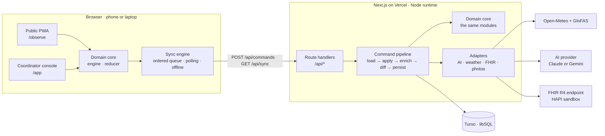

**Every write follows one path:** browser → `POST /api/commands` → the same pure reducer → one version-guarded transaction. **Every read follows one path:** `GET /api/sync?since=<version>` → `304` or the full projection.

---

## 3. System context

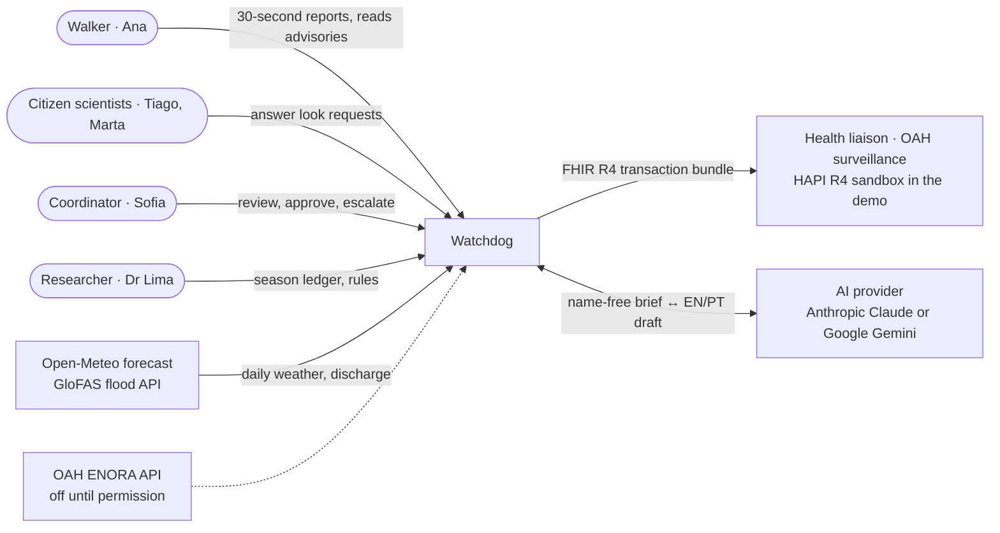

| Actor or system | Kind | Interaction | Trust |
| --- | --- | --- | --- |
| Walker | Person | Follows streams, files reports (signs, dog, photo), reads advisories, erases own data | Untrusted input; weight ×1.0 |
| Citizen scientist | Person | Accepts and answers look requests (verify, resolve) | Untrusted input; ×1.4, verified findings ×1.6 |
| Coordinator | Staff | Reviews signals, requests looks, drafts/edits/approves advisories, escalates, dismisses | Trusted; every action audited |
| Health liaison | Staff / external system | Receives FHIR bundles; downloads from the outbox | External; allow-listed endpoints only |
| Researcher | Staff | Reads the season ledger, rules and self-tests; exports | Read-only |
| Open-Meteo, GloFAS | Public APIs | Daily max temperature, precipitation; river discharge | Public data (CC BY 4.0; Copernicus EMS) |
| AI provider | Processor | Drafts EN/PT advisory text | Sees site, hazard, sign counts, validity only |
| FHIR endpoint | External system | Receives transaction bundles | Synthetic data only on the public sandbox |
| OAH ENORA API | External API | Sites and habitat question codes | Off (`OAH_CONNECTOR_ENABLED=false`) |

---

## 4. Containers

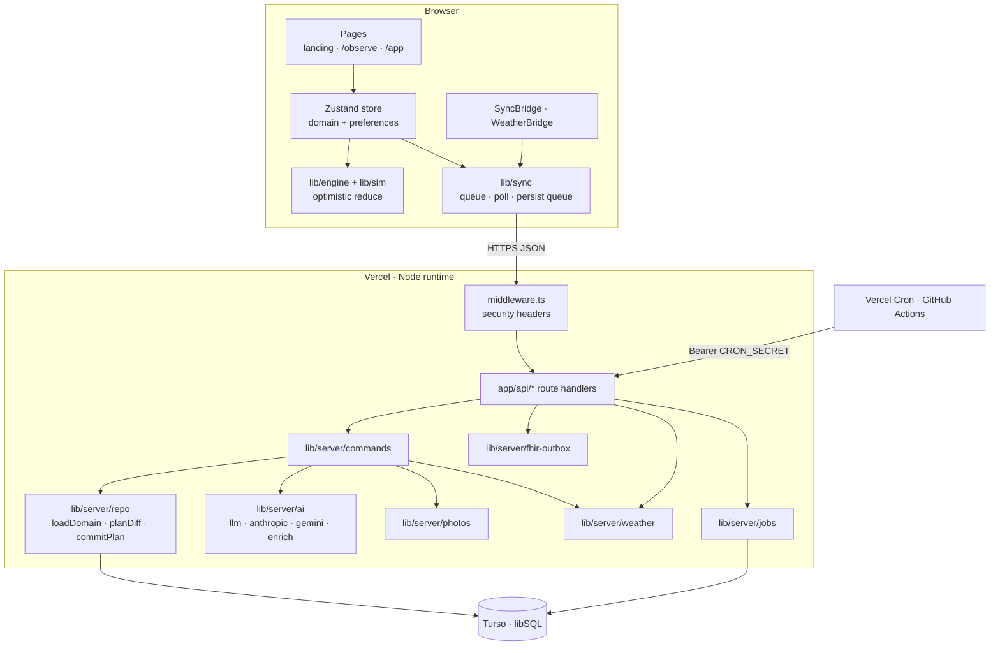

| Container | Technology | Responsibility |
| --- | --- | --- |
| Pages | Next.js App Router, React 19, Tailwind 3 | Landing, public PWA (EN/PT, 390 px), coordinator console (25 routes) |
| Client store | Zustand 5 | Domain state, preferences, device identity; persists to `localStorage` |
| Domain core | `lib/engine`, `lib/sim`, `lib/apply`, `lib/advisory`, `lib/fhir`, `lib/ledger` | Scoring, reducer, guardrails, bundle builder, season ledger — pure TypeScript |
| Sync engine | `lib/sync`, `lib/transport` | Remote transport: optimistic reduce, ordered command queue, polling, offline queue |
| Route handlers | Next.js route handlers | Commands, sync, workspaces, join, photos, weather, FHIR delivery, cron, health |
| Command pipeline | `lib/server/commands` | Validate → authorize → apply → enrich → diff → persist, exactly once |
| Repository | `lib/server/repo`, `lib/server/lock` | Domain ↔ tables, version-guarded transactions, hash-chained audit |
| AI adapter | `lib/server/ai/*` | Provider-neutral JSON drafting (Claude or Gemini), pre-check, retry, fallback |
| Integrations | `lib/server/weather`, `photos`, `fhir-outbox` | Open-Meteo snapshots, sharp re-encoding, FHIR delivery with retries |
| Jobs | `lib/server/jobs`, `/api/cron/*` | Retention, weather refresh, live cycle, outbox retries |
| Database | libSQL (`@libsql/client`) | All state, audit, photos, weather snapshots |

---

## 5. Deployment

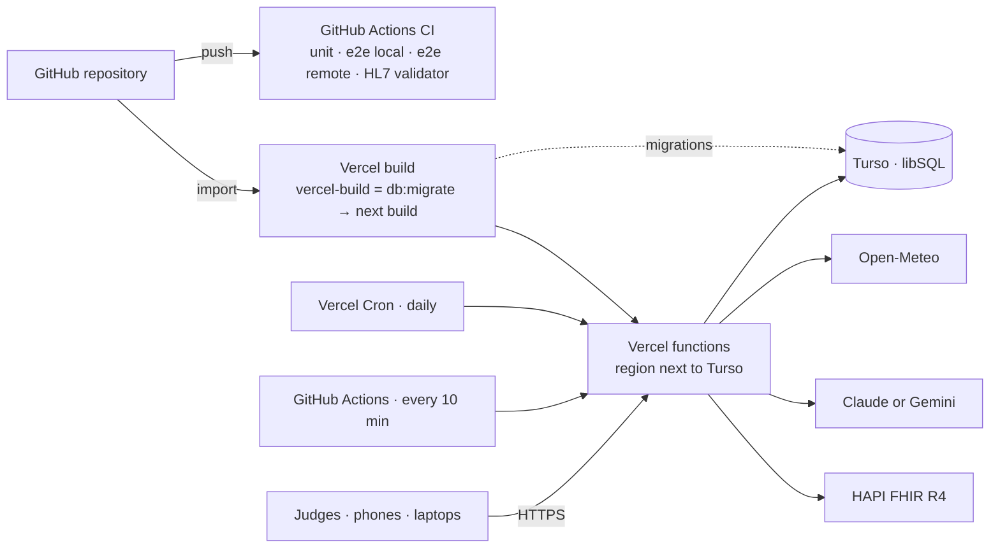

| Environment | Database | Transport | Purpose |
| --- | --- | --- | --- |
| Local dev | `file:.data/watchdog.db` (WAL) | `local` or `remote` | Development, all tests |
| CI | temp SQLite files | both, in separate jobs | Merge gate |
| Production | Turso (`libsql://…`) | `remote` | The link judges open |

Step-by-step: [`DEPLOY.md`](DEPLOY.md).

---

## 6. Directory map

```text
watchdog/
├── app/                                    Next.js App Router
│   ├── layout.tsx · globals.css · manifest.ts · icon.svg · not-found.tsx
│   ├── page.tsx                            Landing
│   ├── login/ · signup/                    Persona sign-in (sandboxes)
│   ├── join/[code]/route.ts                QR join link → sandbox cookie → /observe
│   ├── fhir/CodeSystem/[id]/route.ts       Canonical CodeSystems: sentinel-sign, watch-indicator
│   ├── observe/                            PUBLIC SENTINEL PWA (EN/PT)
│   │   ├── page.tsx                        Streams near you
│   │   ├── sites/[siteId]/                 Site page · status · 72-h risk forecast
│   │   ├── sites/[siteId]/report/          3-step report: signs · dog · photo
│   │   ├── observations/                   My reports
│   │   ├── requests/                       Look requests (citizen scientists)
│   │   └── about/                          Privacy · forget this device
│   ├── app/                                COORDINATOR CONSOLE
│   │   ├── overview/ · sites/ · watches/ · observations/ · signals/ · verification/
│   │   ├── advisories/ (new/, [id]/) · fhir/ ([id]/) · ledger/ ([season]/)
│   │   └── rules/ ([id]/) · sources/ · settings/
│   └── api/                                ROUTE HANDLERS (Node runtime)
│       ├── health/                         DB · migrations · AI · build · config checks
│       ├── workspaces/ · workspaces/current/ (reset/, import/)
│       ├── join/ · sync/ · commands/
│       ├── photos/[key]/                   Re-encoded photos behind capability URLs
│       ├── weather/import/ · weather/revert/ · weather/[city]/
│       ├── fhir/outbox/[id]/send/          Server-side FHIR delivery
│       └── cron/[job]/                     retention · weather · cycle · outbox
├── components/
│   ├── ui · charts · art · icons · network-map · toast · auth · providers
│   ├── sync-bridge.tsx · weather-bridge.tsx
│   ├── shell/                              app-shell · sidebar · topbar · replay · notifications · share-sandbox (QR)
│   ├── observe/                            mobile-shell · public · risk-curve · city-map · sign-grid · photo-input · site-picker · forget-device
│   └── console/                            kit · explain · why-drawer · score-history · request-look · reason-modal ·
│                                           advisory-editor · advisory-bits · advisory-view · photo-view · json-view
├── lib/                                    SHARED BY BROWSER AND SERVER (pure unless noted)
│   ├── types.ts · catalog.ts · utils.ts · i18n.ts · geo.ts · links.ts · hooks.ts · svg.ts · download.ts
│   ├── engine.ts                           Triggers · vulnerability · watch · fusion · signal rule · snapshots
│   ├── sim.ts                              Reducer (15 actions) · scenario script · presets
│   ├── apply.ts                            Reducer + device/erase, identical in both places
│   ├── select.ts · ledger.ts               Selectors · season attribution and measures
│   ├── advisory.ts                         Template drafts · 8 guardrails · whenText
│   ├── fhir.ts · fhir-canonical.ts         R4 bundle builder + validator · canonical base
│   ├── weather.ts                          WeatherProvider · withWeather() · synthetic climatology
│   ├── openmeteo-api.ts · openmeteo.ts     Open-Meteo / GloFAS fetchers · browser snapshot store
│   ├── store.ts · sync.ts · transport.ts   Zustand store · sync engine · typed API client
│   ├── outbox.ts · privacy.ts · photo.ts   FHIR send (local or via server) · erasure · in-browser re-encode
│   ├── selftest.ts                         17 in-browser self-tests
│   └── server/                             SERVER ONLY
│       ├── env.ts · db.ts · migrations.ts · lock.ts · repo.ts
│       ├── workspaces.ts · commands.ts · projection.ts · principal.ts · session.ts · sync.ts
│       ├── photos.ts · weather.ts · fhir-outbox.ts · jobs.ts · ratelimit.ts · domain-shape.ts
│       ├── errors.ts · http.ts
│       └── ai/                             llm · types · anthropic · gemini · advisory-draft · enrich · claude (shim)
├── rules/v1.0.0.json                       Versioned rule parameters
├── middleware.ts                           Security headers (CSP, HSTS, framing, permissions)
├── scripts/                                db-smoke · db-migrate · draft-try · fhir-examples · fhir-validate.sh · render-diagrams.sh
├── tests/unit/ · tests/server/             Vitest (domain, sync, AI drafting, persistence, security, deploy readiness)
├── e2e/                                    Playwright + axe (smoke · golden-path · multi-device · transport · network · a11y · capture)
├── docs/                                   screenshots/ · submission/ · diagrams/
├── .github/workflows/                      ci.yml · cron.yml
└── package.json · tsconfig.json · tailwind.config.ts · next.config.mjs · vitest.config.ts · playwright.config.ts · vercel.json · DEPLOY.md · ARCHITECTURE.md · README.md · LICENSE (Apache-2.0)
```

---

## 7. Domain model

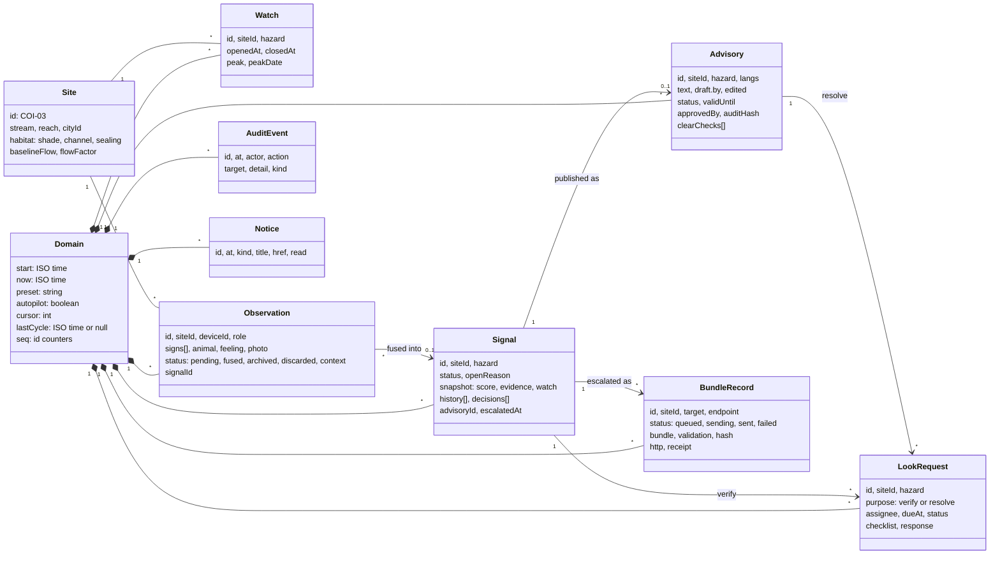

| Entity | Id | Created by | Key invariant |
| --- | --- | --- | --- |
| Watch | `W-…` | Watch cycle (07:00 and 19:00 UTC) | One open watch per site and hazard |
| Observation | `OB-…` | `observation/submit`, `look/respond` | One device counts once in fusion |
| Signal | `SIG-…` | Signal rule after fusion | One active signal per site and hazard; a dismissed signal never reopens from the same reports |
| LookRequest | `LR-…` | `look/request` | Resolve looks need a live advisory |
| Advisory | `ADV-…` | `advisory/draft` or `advisory/create` | Published only from draft, only through the guardrail gate |
| BundleRecord | `FHIR-…` | `signal/escalate` or publish with escalate | Delivery status written by the server only |
| AuditEvent | `EV-…` | Every decision | Append-only, hash-chained in storage |

---

## 8. Scoring engine

### 8.1 Pipeline

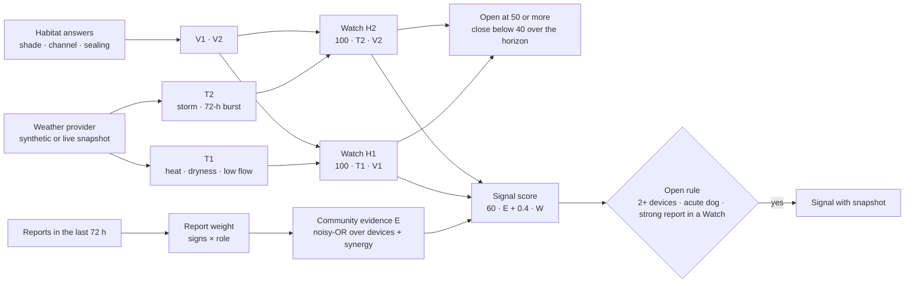

### 8.2 Equations (rules v1.0.0)

```math
\begin{aligned}
T_1 &= 0.50\,\mathrm{clamp}\!\left(\tfrac{T_{max}-28}{8}\right) + 0.25\,\mathrm{clamp}\!\left(\tfrac{14-r_{14}}{14}\right) + 0.25\,\mathrm{clamp}\!\left(\tfrac{0.5-q}{0.25}\right)\\
T_2 &= 0.45\,\mathrm{clamp}\!\left(\tfrac{r_{24}-8}{22}\right) + 0.55\,\mathrm{clamp}\!\left(\tfrac{r_{72}-15}{35}\right)\\
V_1 &= 0.4\,(1-\mathrm{shade}) + 0.3\,\mathrm{channel} + 0.3\,\mathrm{sealing} \qquad V_2 = 0.6\,\mathrm{sealing} + 0.4\,\mathrm{channel}\\
W &= \mathrm{round}(100\,T\,V)\\
w_r &= \min\!\Big(0.6,\ \big(1-\textstyle\prod_{g}(1-w_g)\big)\,m_{role}\Big), \qquad m = 1.0,\ 1.4,\ 1.6\\
E &= \min\!\Big(1,\ 1-\textstyle\prod_{devices}(1-w_r) + 0.075\,(k-1)\Big)\\
S &= \mathrm{round}(100 \cdot 0.6\,E + 0.4\,W)
\end{aligned}
```

`q` = flow ratio to normal; `k` = number of sign categories (water, wildlife, animal); `m` = walker, citizen scientist, verified finding.

### 8.3 Rules

| Rule | Value |
| --- | --- |
| Watch opens | Any of today + 2 days scores ≥ 50 |
| Watch closes | Every horizon day < 40 |
| Evaluation | 07:00 and 19:00 UTC, and on every clock advance |
| Signal opens | ≥ 2 distinct devices · or an acute dog report (onset < 2 h) · or one report with w ≥ 0.35 during a Watch |
| Fusion window | 72 h; uncorroborated reports archive after that |
| Advisory gate | S ≥ 75 is guidance only; a person always decides |
| Advisory validity | 72 h by default, editable, at least 1 h ahead |
| Resolution | 2 "no signs" checks by different volunteers, ≥ 24 h after publication |

### 8.4 Sign weights

| Sign | w | Hazard |
| --- | --- | --- |
| More than 10 dead fish | 0.40 | H1, H2 |
| Floating mats or scum | 0.25 | H1 |
| 2–10 dead fish | 0.25 | H1, H2 |
| Dog unwell, onset < 2 h (later) | 0.25 (0.12) | H1, H2 |
| Sewage odour · sanitary litter · sick or dead waterbird | 0.22 | H2 · H2 · H1, H2 |
| Dark mats on stones · dead amphibians | 0.20 | H1 · H1, H2 |
| Blue-green colour · grey or milky water · invertebrate die-off | 0.18 | H1 · H2 · H1, H2 |
| Persistent foam · one dead fish | 0.12 | H2 · H1, H2 |
| Oily sheen · very low or stagnant water | 0.10 | H2 · H1 |

### 8.5 Worked example — golden path, COI-03, 25 Sep

| Step | Calculation | Result |
| --- | --- | --- |
| Watch | 100 × T1 0.872 × V1 0.793 | **W = 69**, Watch open |
| Ana: dark mats + dog < 2 h | 1 − 0.80 × 0.75 = 0.40; 2 categories +0.075 | E = 0.475 → **S = 56**, opens (acute dog) |
| Rui: floating scum | 1 − 0.60 × 0.75 = 0.55; +0.075 | E = 0.625 → **S = 65** |
| Tiago, verified: mats, 2–10 fish, low water | (1 − 0.8 × 0.75 × 0.9) × 1.6 → cap 0.60; base 0.82; 3 categories +0.15 | E = 0.97 → **S = 86** |

All weights are illustrative until calibrated with OneAquaHealth ecologists. A rule change means a new rules file, both versions loadable, updated golden fixtures and an ADR.

---

## 9. Lifecycles

### 9.1 Signal

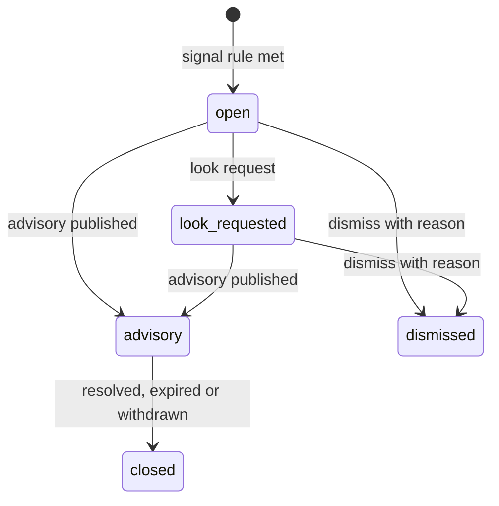

### 9.2 Advisory

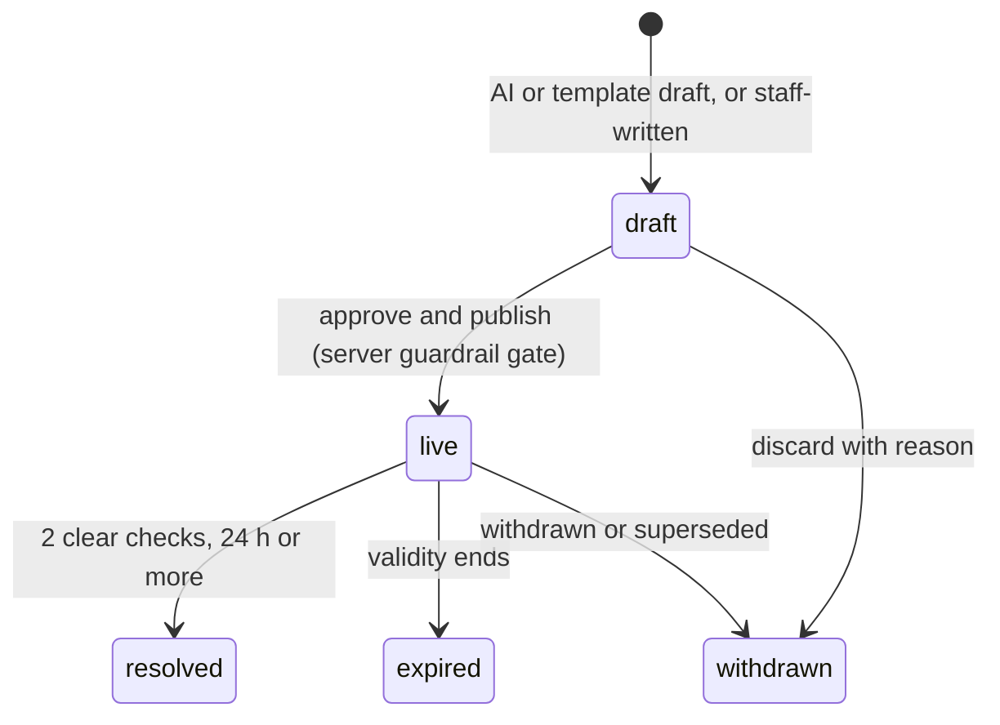

### 9.3 Look request

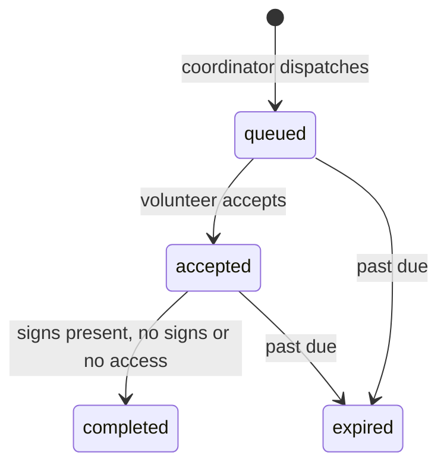

### 9.4 Observation

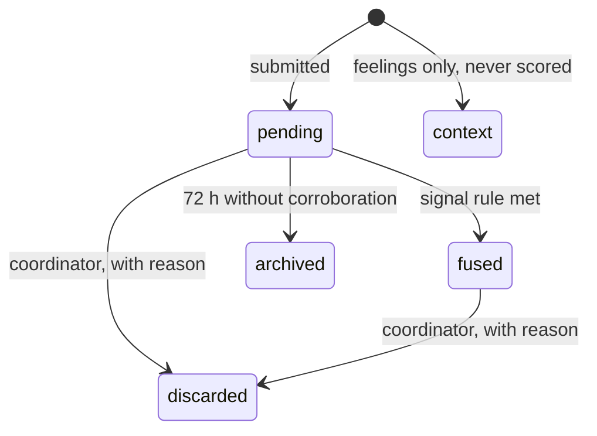

### 9.5 Public site tier (derived, never stored)

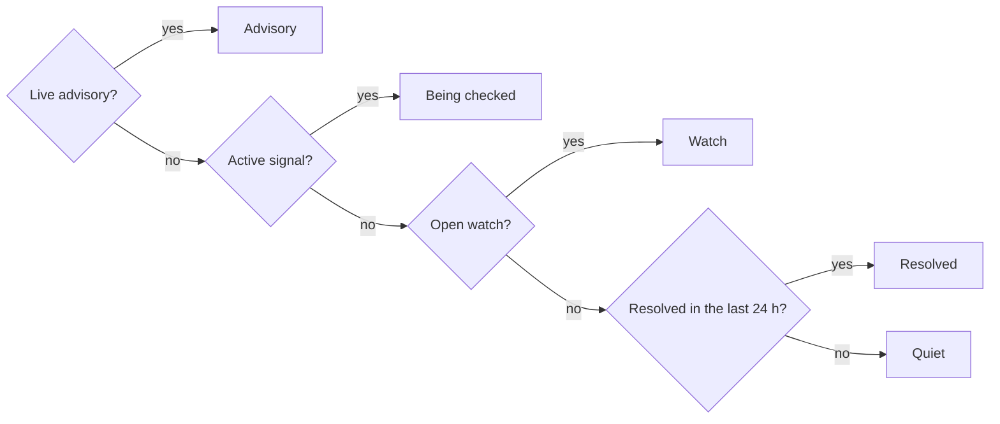

---

## 10. Command pipeline

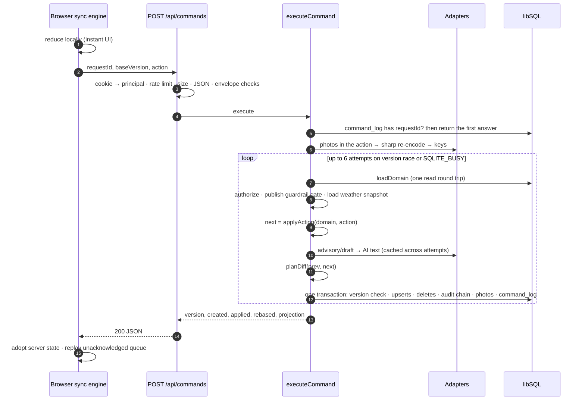

| Concern | Mechanism |
| --- | --- |
| Exactly once | `command_log (workspace_id, request_id)` inside the same transaction; a duplicate returns the stored summary |
| Stale client | `baseVersion` mismatch → the action is re-applied to the latest state (`rebased: true`); the server's result wins |
| Concurrency | `UPDATE workspaces … WHERE version = ?`; mismatch → reload and retry; in-process write lock serialises SQLite writers |
| Validation | Envelope shape, 4 MB limit, forbidden keys (`__proto__`…), finite numbers; the reducer ignores what it cannot apply |
| Authorization | Workspace from the signed cookie; sandbox principals act only in demo workspaces; `bundle/status` is server-only |
| Human gate | `advisory/publish` re-runs all blocking guardrails on the stored text and refuses with `422 guardrail_failed` |
| Clock abuse | `advance` limited to 14 days per command, sandboxes only |

| Action | Sent by | Server-side extra |
| --- | --- | --- |
| `advance` | Replay clock (≤ 1 per 5 s) | Sandbox only; 14-day cap |
| `observation/submit` | Walker, volunteer | Photos re-encoded; photo rate limit |
| `observation/discard`, `signal/dismiss`, `advisory/withdraw` | Coordinator | Reason required (UI) |
| `signal/escalate` | Coordinator | Builds and validates the FHIR bundle |
| `look/request`, `look/accept`, `look/respond` | Coordinator, volunteer | Verified findings weigh ×1.6 |
| `advisory/draft` | Coordinator | AI draft swapped in, guardrail-checked |
| `advisory/create`, `advisory/edit` | Coordinator | — |
| `advisory/publish` | Coordinator | Guardrail gate; audit hash; optional escalation |
| `notices/read` | Any staff | — |
| `device/erase` | Walker | `eraseDevice` + orphaned photo deletion |
| `bundle/status` | **Server only** | Written by the FHIR outbox |

---

## 11. Client sync engine

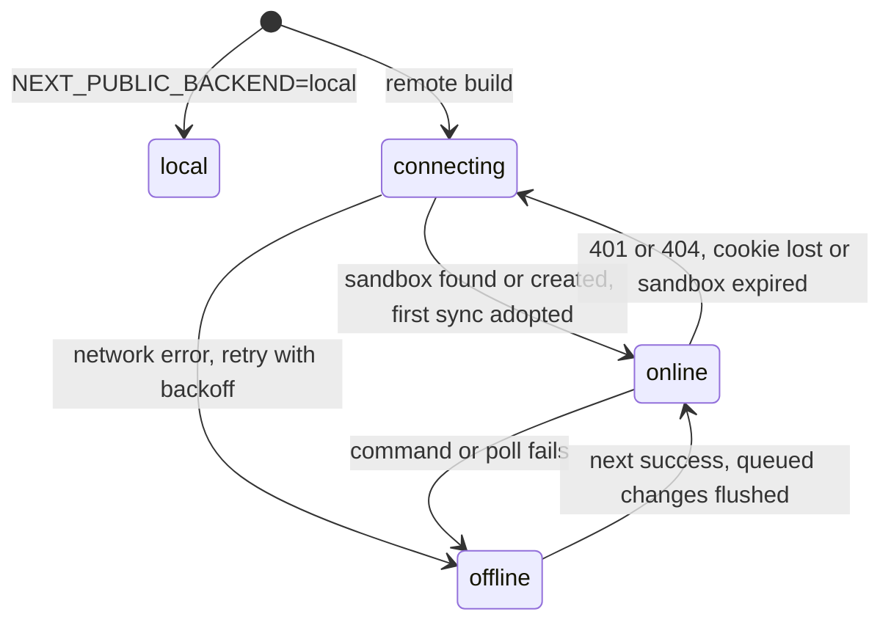

| Behaviour | Rule |
| --- | --- |
| Optimistic UI | Every action is reduced locally first, then queued |
| Ordering | One command in flight; the queue is FIFO |
| Replay clock | Consecutive `advance` ticks coalesce; at most one sent every 5 s |
| Adoption | Server projection + replay of unsent actions; never steps back to an older version of the same sandbox |
| Polling | `GET /api/sync?since=v` every 4 s visible, 30 s hidden; `304` costs nothing |
| Offline | Queue kept and persisted (`watchdog-sync-queue`); retried with backoff (1 → 30 s); "Working offline" toast |
| Reloads | The persisted queue is resent with the same request ids — the server applies each once |
| Navigation | Small commands use `fetch(…, { keepalive: true })` |
| Rejection | 4xx → the change is dropped, "Change not saved" toast, full resync |
| Expiry | 404 → a fresh sandbox is created and the user is told |

---

## 12. Workspaces and the replay clock

| | Demo sandbox | Live workspace (planned) |
| --- | --- | --- |
| Created by | First visit, or a preset jump | An administrator, once |
| Identity | Signed HTTP-only cookie `wd_ws` | Device tokens (walkers), staff sign-in |
| Clock | Replay clock, advanced by the visitor | Real time via `/api/cron/cycle` |
| Weather | Synthetic; live Open-Meteo per city on request | Live, refreshed on schedule |
| Script | Golden path + background events per preset | None |
| Lifetime | Deleted after 7 idle days | Permanent |

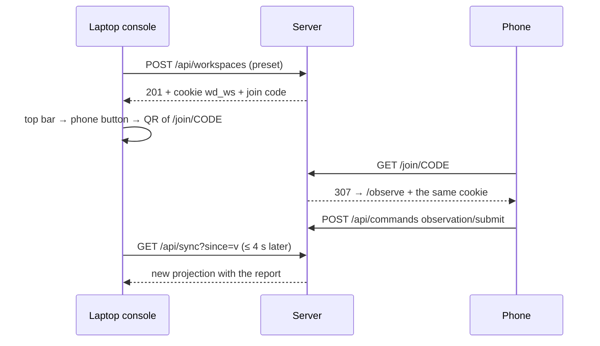

Join codes use 6 characters from `ABCDEFGHJKMNPQRSTUVWXYZ23456789` (no 0/O or 1/I/L). A reset replaces the world in place: same id and join code, so joined phones stay attached.

---

## 13. Persistence

### 13.1 Storage shape

Each domain table keeps a few real columns for queries (ids, site, status, dates) plus `data` — the full entity as JSON in its `lib/types.ts` shape — and `pos`, which preserves newest-first order. A load rebuilds the exact domain (round trip is byte-identical for every preset); a persist is a mechanical diff by id.

### 13.2 Entity–relationship

```mermaid
erDiagram
  WORKSPACES ||--o{ WATCHES : has
  WORKSPACES ||--o{ OBSERVATIONS : has
  WORKSPACES ||--o{ SIGNALS : has
  WORKSPACES ||--o{ LOOKS : has
  WORKSPACES ||--o{ ADVISORIES : has
  WORKSPACES ||--o{ FHIR_OUTBOX : has
  WORKSPACES ||--o{ NOTICES : has
  WORKSPACES ||--o{ AUDIT_EVENTS : chains
  WORKSPACES ||--o{ COMMAND_LOG : dedupes
  WORKSPACES ||--o{ PHOTOS : stores
  WORKSPACES ||--o{ REPORTERS : planned
  CITIES ||--o{ SITES : contains
  CITIES ||--o{ WEATHER_DAILY : snapshots
  WORKSPACES {
    text id PK
    text kind "demo or live"
    text join_code "unique"
    int version "optimistic lock"
    text audit_head "last hash"
    text weather_mode "city to snapshot"
  }
  OBSERVATIONS {
    text workspace_id PK
    text id PK
    int pos
    text site_id
    text status
    text device_id
    text data "entity JSON"
  }
  SIGNALS {
    text workspace_id PK
    text id PK
    text site_id
    text hazard
    text status
    text data "includes snapshot"
  }
  ADVISORIES {
    text workspace_id PK
    text id PK
    text status
    text valid_until
    text data
  }
  FHIR_OUTBOX {
    text workspace_id PK
    text id PK
    text status
    int attempts
    text next_attempt_at
    text data "bundle and receipt"
  }
  AUDIT_EVENTS {
    text workspace_id PK
    text id PK
    int seq
    text prev_hash
    text hash
  }
  PHOTOS {
    text key PK
    text workspace_id
    blob body "EXIF-free JPEG"
    text delete_after
  }
  WEATHER_DAILY {
    text city_id PK
    text date PK
    text source PK "open-meteo:fetchedAt"
    real tmax
    real rain
  }
  COMMAND_LOG {
    text workspace_id PK
    text request_id PK
    text response
  }
```

| Table | Key | Notes |
| --- | --- | --- |
| `workspaces` | `id` | kind, preset, join code, clock scalars, `version`, `pos_seq`, `audit_seq`, `audit_head`, `weather_mode`, TTL |
| `watches` · `observations` · `signals` · `looks` · `advisories` · `fhir_outbox` · `notices` | `(workspace_id, id)` | Indexed columns + `data` JSON + `pos` |
| `audit_events` | `(workspace_id, id)` | `seq`, `prev_hash`, `hash`; triggers forbid UPDATE, and DELETE in the live workspace |
| `photos` | `key` | 128-bit key, `body` BLOB, dimensions, owner device, `delete_after` (90 days) |
| `weather_daily` | `(city_id, date, source)` | Immutable Open-Meteo snapshots |
| `command_log` | `(workspace_id, request_id)` | Idempotency, pruned after 24 h |
| `cities` · `sites` · `people` | `id` | Catalog mirror |
| `reporters` · `follows` · `invites` · `staff` | — | Reserved for the live workspace (planned) |
| `rate_limits` | `key` | Reserved (limits are in-process today) |
| `schema_migrations` | `id` | Applied migrations |

### 13.3 Audit hash chain

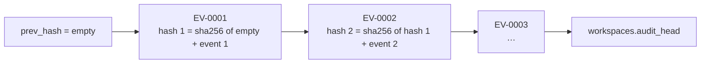

Editing, removing or reordering any event breaks every later hash; `verifyAuditChain` recomputes the chain end to end. Published advisories additionally carry an `auditHash` over text, validity, approver, time and rules sha.

### 13.4 Migrations

| Id | Contents |
| --- | --- |
| `0001_init` | 20 tables, indexes, audit triggers |
| `0002_photos` | `photos.device_id`, `mime`, `body` (BLOB); index on workspace and device |

Migrations are append-only, applied on first connection and, on Vercel, during the build (`vercel-build → db:migrate`).

---

## 14. HTTP API

| Method | Path | Caller | Purpose | Limit |
| --- | --- | --- | --- | --- |
| GET | `/api/health` | Anyone | DB, migrations, rules, AI, build transport, config checks | — |
| POST | `/api/workspaces` | Anyone | Create a sandbox from a preset; sets `wd_ws` | 60/h per IP |
| GET | `/api/workspaces/current` | Sandbox | Id, kind, join code, version | — |
| POST | `/api/workspaces/current/reset` | Sandbox | Replace the world with a preset, in place | — |
| POST | `/api/workspaces/current/import` | Sandbox | Replace the world with an exported state file | 10/h |
| POST | `/api/join` | Anyone | Attach this browser by typed code | 30 per 10 min per IP |
| GET | `/join/[code]` | Anyone | QR link → cookie → redirect (same-site paths only) | 30 per 10 min per IP |
| GET | `/api/sync?since=` | Sandbox | `304` or `{ version, role, workspace, projection }` | — |
| POST | `/api/commands` | Sandbox | Apply one action | 180/min; photos 60/h |
| GET | `/api/photos/[key]` | Capability | EXIF-free JPEG, `nosniff`, immutable cache | — |
| POST | `/api/weather/import` | Sandbox | Fetch Open-Meteo on the server, snapshot it | 20/h |
| POST | `/api/weather/revert` | Sandbox | Back to synthetic weather for a city | — |
| GET | `/api/weather/[city]` | Sandbox | The snapshot this sandbox scores with | — |
| POST | `/api/fhir/outbox/[id]/send` | Sandbox | Server-side delivery to an allow-listed endpoint | 30/h |
| GET · POST | `/api/cron/[job]` | Scheduler | `retention` · `weather` · `cycle` · `outbox` | Bearer `CRON_SECRET` |
| GET | `/fhir/CodeSystem/[id]` | Anyone | `sentinel-sign`, `watch-indicator` CodeSystems | static |

Errors are JSON problem details (`lib/server/http.ts`) with an HTTP `status` number, a machine-readable `code` string (`ProblemCode`), and a human-readable `detail` string, plus optional contextual fields (such as `checks` for `guardrail_failed` or `retryAfterSeconds` for `rate_limited`):

```json
{
  "status": 422,
  "code": "guardrail_failed",
  "detail": "Publishing refused: Tone: keep the wording calm and observational.",
  "checks": [{ "rule": "tone", "label": "Tone", "blocking": true, "pass": false, "detail": "Avoid alarmist wording" }]
}
```

Responses that change state carry `X-Workspace-Version`.

---

## 15. AI drafting

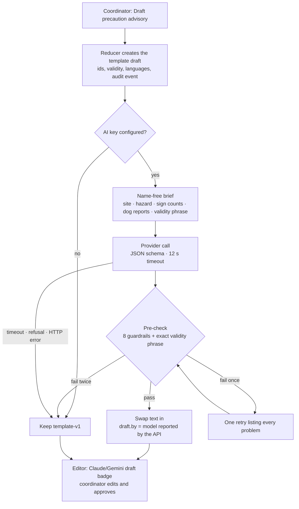

| Aspect | Design |
| --- | --- |
| Providers | Anthropic (`claude-sonnet-5`, JSON outputs, effort `low`) or Google (`gemini-2.5-flash`, response schema, thinking off). Key present picks; `LLM_PROVIDER` breaks ties |
| Input | Structured, name-free brief. Never reporter text, names, device ids or photos → prompt injection cannot reach public wording |
| Output | `{ en, pt }` (Portuguese only for Portuguese cities); ≤ 60 words; sentences < 20 words; exact validity phrase; fixed closing line |
| Checks | Hard: blocking guardrails + validity phrase. Soft: warnings, 60 words, closing line, validity stated once |
| Honesty | `draft.by` and the audit detail record the model name the API returned, the prompt version, latency and input/output hashes |
| Limits | 20 drafts per sandbox per hour; one call per command even across commit retries |
| Human gate | The editor shows every check; the server refuses to publish on any blocking failure |

**Guardrails (shared by editor, drafting pre-check and publish gate)**

| Check | Blocking | Rule |
| --- | --- | --- |
| Every language filled | ✓ | ≥ 20 characters per language |
| No alarmist words | ✓ | e.g. deadly, toxic, poison, contaminated, outbreak, panic (EN/PT/NL) |
| No diagnosis or clinical claims | ✓ | e.g. diagnosis, infection, poisoning, disease |
| Never calls a site "safe" | ✓ | safe/safety, seguro/segura, veilig |
| States the validity window | ✓ | The expiry time appears in every language |
| Says it is a precaution | — | "precaution" / "precaução" |
| Sentences under 20 words | — | Per sentence |
| Plain language (≈ CEFR B1) | — | Average ≤ 15 words per sentence |

---

## 16. FHIR interoperability

### 16.1 Bundle composition

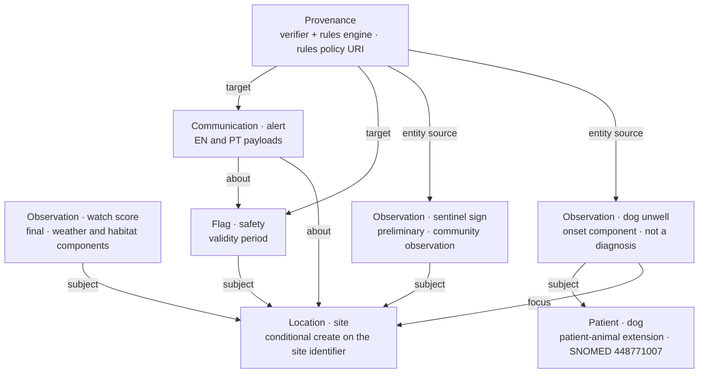

| Resource | Identifiers & Conditional Create | Content |
| --- | --- | --- |
| `Bundle` | `id: bundleId.toLowerCase()` | `transaction`, tagged `synthetic-demo` |
| `Location` | `system: ${SID_SITE}`, `value: site.id`<br/>`ifNoneExist: identifier=${SID_SITE}\|${site.id}` | Site identifier, name, reach, physical type, city/country, position |
| `Observation` (watch) | `system: ${CS_WATCH}/id`, `value: ${bundleId}\|watch-score-${hazard}` | Watch score (`{score}`), components: Tmax (Cel), 14-day rain (mm), flow ratio, vulnerability; note "forecast, not a measurement of toxins" |
| `Observation` (signs) | `system: ${CS_SIGN}/id`, `value: ${bundleId}\|${sign}` | One per distinct sign, `preliminary`, code from the `sentinel-sign` CodeSystem |
| `Patient` | `system: ${SID_SITE}/patient`, `value: ${site.id}\|${name}`<br/>`ifNoneExist: identifier=${SID_SITE}/patient\|${site.id}\|${name}` | The dog as an animal patient (SNOMED 448771007 species code) |
| `Observation` (animal) | `system: ${CS_SIGN}/id`, `value: ${bundleId}\|dog_unwell` | Owner-observed symptoms and onset; "not a veterinary diagnosis" |
| `Flag` | `system: ${SID_SITE}/flag`, `value: ${bundleId}\|safety` | Category `safety`, subject the site, period = publication → validity |
| `Communication` | `system: ${SID_SITE}/advisory`, `value: ${bundleId}\|advisory` | Category `alert`, about the Flag and site, payload per language, approver and audit hash |
| `Provenance` | `ifNoneExist: target=${watchUrl}` | Targets every bundle entry; conditional create on the watch score Observation URL prevents duplicate conflict on public HAPI; agents: verifier (coordinator) and assembler (rules engine) |

Scoped business identifiers combined with conditional creates ensure that re-sending an identical bundle or re-submitting to a shared public endpoint (such as `hapi.fhir.org/baseR4`) updates existing resources idempotently without creating duplicate entities or triggering HTTP 412 Precondition Failed errors.

### 16.2 Canonical URIs

All Watchdog system URIs derive from `NEXT_PUBLIC_FHIR_CANONICAL` (e.g. `https://<app>/fhir`). The app serves `CodeSystem/sentinel-sign` and `CodeSystem/watch-indicator` at those exact URLs, so the systems resolve. Standard systems: HL7 terminology, SNOMED CT, UCUM.

### 16.3 Delivery

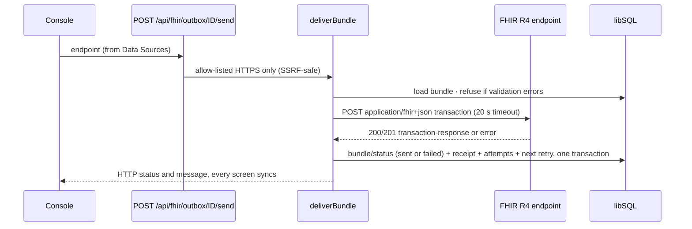

| Retry after attempt | 1 | 2 | 3 | 4–8 |
| --- | --- | --- | --- | --- |
| Wait | 1 min | 5 min | 15 min | 60 min |

Sandboxes send only when a person presses the button; `/api/cron/outbox` retries due bundles of the live workspace. Validation: local structural checks on every build (`validateBundle`) and the official HL7 FHIR Validator in CI (`npm run fhir:validate`).

---

## 17. Weather and hydrology

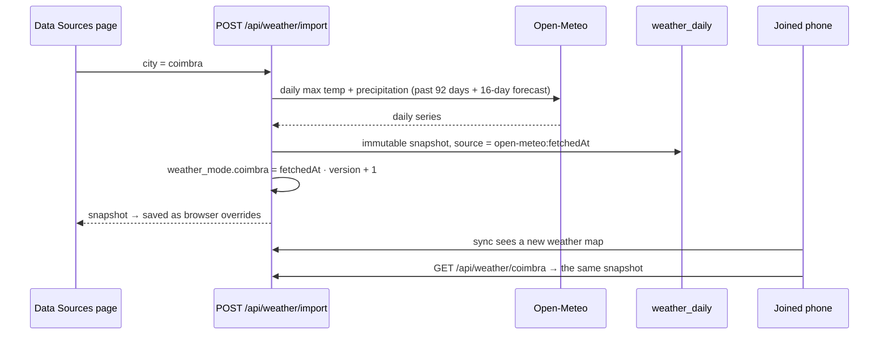

| Provider | Id | Used by |
| --- | --- | --- |
| Synthetic | `synthetic` | New sandboxes; scripted heatwave on the golden path; seeded climatology elsewhere |
| Browser | `browser` | Local mode: synthetic + imported overrides |
| Live overlay | `live:<hash>` | Server: synthetic + this sandbox's snapshots; the id changes when snapshots change |

`withWeather(provider, fn)` swaps the active provider around a synchronous call (safe because the reducer never awaits); engine memo keys include the provider id. GloFAS discharge (≈ 5 km grid) is shown as information only; v1.0.0 uses a rain-derived flow index.

---

## 18. Photos, privacy and retention

```mermaid
flowchart LR
  cam["Camera or gallery"] --> b["Browser re-encode<br/>canvas · GPS/EXIF dropped"]
  b --> cmd["observation/submit<br/>data URL in the action"]
  cmd --> s["Server re-encode · sharp<br/>≤ 1600 px JPEG · metadata dropped"]
  s --> db[("photos.body<br/>128-bit key")]
  s --> url["Report stores /api/photos/key"]
  db --> gc["Deleted when nothing references it,<br/>on erasure, or after 90 days"]
```

| Data | Stored | Retention |
| --- | --- | --- |
| Device identity | Random pseudonymous id (`anon-xxxx`), optional first name and pet name on the device | Until "Forget this device" |
| Reports | Signs, dog signs, onset, feeling, site, time, photo key | Season; erasure on request |
| Photos | EXIF-free JPEG | 90 days unless attached to an advisory |
| Human health data | **Never collected** | — |
| Command log | Request ids and summaries | 24 h |
| Sandboxes | Whole world | 7 idle days |
| Weather snapshots | Public data | Deleted when no workspace references them |

**Erasure** (`device/erase`, the same `eraseDevice` in browser and server): pending reports deleted, fused reports anonymised, orphaned photos deleted in the same transaction. **Synthetic data** is labelled on every screen and every FHIR resource.

---

## 19. Security

### 19.1 Trust boundaries

```mermaid
flowchart LR
  subgraph public["Untrusted"]
    br["Browsers and phones"]
  end
  subgraph edge["Boundary"]
    mw["middleware.ts<br/>CSP · HSTS · frame-ancestors none"]
    rh["Route handlers<br/>principal · rate limits · envelope checks"]
  end
  subgraph core["Trusted server"]
    cmd["Command pipeline<br/>authorize · guardrail gate"]
    db[("libSQL")]
  end
  subgraph outside["Outside services"]
    ai["AI provider<br/>name-free brief only"]
    fh["FHIR endpoints<br/>HTTPS allow-list"]
    om["Open-Meteo"]
  end
  br --> mw --> rh --> cmd --> db
  cmd --> ai
  rh --> fh
  rh --> om
```

### 19.2 Principals

| Principal | Proof | Scope |
| --- | --- | --- |
| Sandbox visitor | HMAC-signed HTTP-only cookie `wd_ws` (SameSite=Lax, Secure in production) | One demo workspace, any persona |
| Scheduler | `Authorization: Bearer CRON_SECRET`, constant-time compare | `/api/cron/*` |
| Photo viewer | 128-bit capability key | One photo |
| Walker / volunteer / staff in the live workspace | Device token, invite code, staff sign-in | Planned |

### 19.3 Headers

`Content-Security-Policy` (self; `connect-src` self + Open-Meteo + HAPI; `frame-ancestors 'none'`; `object-src 'none'`; `base-uri 'self'`) · `Strict-Transport-Security` · `X-Frame-Options: DENY` · `X-Content-Type-Options: nosniff` · `Referrer-Policy: strict-origin-when-cross-origin` · `Permissions-Policy: camera=(self), geolocation=(self), microphone=()`.

### 19.4 Threat model (STRIDE)

| Threat | Example | Mitigation |
| --- | --- | --- |
| Spoofing | Guessing a join code | 31⁶ ≈ 887 million codes; 30 attempts per 10 min per IP |
| Tampering | Rewriting a past decision | Hash-chained audit; UPDATE forbidden by trigger; advisory audit hash |
| Repudiation | "I never approved that" | Audit event + FHIR Provenance with approver, time and rules version |
| Information disclosure | Reporter identity reaching the public or the AI | Pseudonymous ids; name-free AI brief; EXIF stripped twice |
| Denial of service | Command floods, AI cost abuse | Per-sandbox and per-IP limits; 20 AI drafts/h; body size caps |
| Elevation of privilege | Browser forges a delivery receipt | `bundle/status` server-only; tested |
| SSRF | Server told to POST into a private network | HTTPS allow-list of FHIR endpoints; no credentials in URLs |
| Prompt injection | A report note instructs the model | The model never sees report text and has no tools; output is schema-constrained and guardrail-checked |
| Clickjacking | Console framed by another site | `frame-ancestors 'none'`, `X-Frame-Options: DENY` |

---

## 20. Reliability and performance

| Failure | Behaviour |
| --- | --- |
| Server or database unreachable | Browser keeps working; changes queue and persist; toast; automatic recovery |
| Version race or SQLite busy | Reload, re-apply, retry (6 attempts, exponential backoff) |
| AI slow, down or refusing | Template draft within the timeout; audit says why |
| Open-Meteo down | Import fails with a clear message; sandbox keeps its previous weather |
| FHIR endpoint down | Status `failed` + next retry time; publication is never blocked |
| Sandbox expired | A fresh sandbox is created and the user is told |

| Measure (local dev, 26 Sep 2026) | Value | Source |
| --- | --- | --- |
| New sandbox from a preset | 7–9 ms | `npm run db:smoke` |
| Persist → load round trip | byte-identical for all 5 presets | persistence tests |
| Phone report visible on the laptop | ≈ 4.3 s (4 s poll) | multi-device e2e |
| AI draft, Gemini 2.5 Flash | 1.5–4.5 s, 1–2 attempts | `npm run draft:try` |
| FHIR delivery to HAPI R4 | HTTP 200 transaction-response | `@network` e2e |

| Budget | Target |
| --- | --- |
| Command p95, excluding AI | ≤ 400 ms |
| Sync when unchanged (`304`) | ≤ 100 ms |
| Sandbox projection, gzipped | ≤ 150 KB |
| Site page LCP on mobile 4G | ≤ 2.5 s |

**Scale path:** sandboxes hold hundreds of rows (whole-domain load per command). For a live pilot (100 sites, ~10 000 reports per season): load active records plus 30 days, then per site and hazard; one live workspace per city as the tenant boundary; server-sent events instead of polling; shared rate limiting.

---

## 21. Scheduled jobs

| Job | Schedule | Scope | Does |
| --- | --- | --- | --- |
| `retention` | Daily 03:00 UTC (Vercel Cron) | All | Delete sandboxes idle 7 days, photos past 90 days, command log > 24 h, unreferenced weather snapshots |
| `weather` | Daily 03:30 UTC (Vercel Cron) | Live workspace | Refresh live weather for its cities |
| `cycle` | Every 10 min (GitHub Actions) | Live workspace | Advance to real time: watch cycles, look expiry, advisory expiry |
| `outbox` | Every 10 min (GitHub Actions) | Live workspace | Retry due FHIR bundles |

Sandboxes never call outside services from a job — only when a person presses a button.

---

## 22. Testing and CI

```mermaid
flowchart TB
  e2e["End to end · Playwright<br/>golden path · smoke · multi-device · a11y · transport guard · @network"]
  srv["Server · Vitest<br/>persistence · commands · routes · photos · drafting · integrations"]
  unit["Unit · Vitest<br/>17 self-tests · weather scoping · sync engine · AI adapters · deploy readiness"]
  unit --> srv --> e2e
```

| Layer | What it proves |
| --- | --- |
| Self-tests (17, 4 762 cases) | Score bounds over 122 days × 12 sites × 2 hazards, monotonicity, order-independent fusion, guardrails, FHIR validity, replay determinism, reducer purity, golden path |
| Persistence | Round trip byte-identical; diffs exact; stale writes refused; audit chain intact; audit rows immutable |
| Commands and routes | Exactly-once, rebasing, concurrency, envelope validation, cookies, `304`, join links, reset, import |
| Photos and privacy | EXIF gone after upload; photo route headers; erasure deletes orphaned photos |
| AI | Request shape for both providers, typed failures, retry, fallback, honest labels, name-free brief |
| Integrations | Weather snapshots, FHIR builder v2, delivery receipts and retries, SSRF allow-list, cron auth, retention |
| End to end | Both transports; axe WCAG 2.1 AA (0 serious or critical); a phone report reaches the laptop |

```mermaid
flowchart LR
  push["push or PR"] --> u["unit<br/>typecheck + Vitest"]
  push --> el["e2e-local<br/>build + Playwright"]
  push --> er["e2e-remote<br/>NEXT_PUBLIC_BACKEND=remote"]
  push --> fv["fhir<br/>examples + HL7 validator"]
```

---

## 23. Configuration

| Variable | Scope | Required | Purpose |
| --- | --- | --- | --- |
| `NEXT_PUBLIC_BACKEND` | build | yes | `local` (single browser) or `remote` (server-authoritative) |
| `DATABASE_URL` · `DATABASE_AUTH_TOKEN` | server | production | Turso `libsql://…` and token (local default `file:.data/watchdog.db`) |
| `SESSION_SECRET` | server | production | 32+ characters; signs the sandbox cookie |
| `CRON_SECRET` | server | for jobs | Bearer secret for `/api/cron/*` |
| `DEMO_MODE` · `SANDBOX_TTL_DAYS` · `COOKIE_SECURE` | server | — | Sandboxes on/off, idle TTL, cookie override for LAN testing |
| `ANTHROPIC_API_KEY` · `ANTHROPIC_MODEL` | server | one AI key | Claude drafting |
| `GEMINI_API_KEY` · `GEMINI_MODEL` · `GEMINI_AUTH` | server | one AI key | Gemini drafting |
| `LLM_PROVIDER` · `LLM_EFFORT` · `LLM_TIMEOUT_MS` | server | — | Tie-break, effort, timeout |
| `FHIR_DEFAULT_ENDPOINT` · `FHIR_ALLOWED_ENDPOINTS` | server | — | Delivery target and HTTPS allow-list |
| `NEXT_PUBLIC_FHIR_CANONICAL` | build | production | `https://<app>/fhir` |
| `NEXT_PUBLIC_CSP_CONNECT` | build | — | Extra browser `connect-src` origins |

`/api/health` reports configuration problems as messages, never values.

---

## 24. Architecture decisions

| ADR | Decision | Why | Rejected |
| --- | --- | --- | --- |
| 001 | Deterministic, versioned rules | Explainable to ecologists; testable; no labelled training data exists | Machine-learned risk model |
| 002 | Synthetic-first data; OAH connector behind a flag | Publishable demo; data-use permission pending | Caching OAH data in the repo |
| 003 | Next.js monolith | One deploy, shared types | Separate backend service |
| 004 | libSQL (Turso) with the plain client and SQL migrations | SQLite locally, managed in production; fewer moving parts | ORM layer |
| 005 | FHIR R4 transaction bundles | OneAquaHealth's FHIR guide targets R4 | Custom JSON only |
| 006 | Human approval for every advisory, enforced by the server | Ethics, liability, public trust | Auto-publish above a score |
| 007 | No satellite pixel analysis | Urban streams are narrower than the pixels | Remote-sensing indices |
| 008 | GloFAS as information only | ≈ 5 km grid is too coarse for small streams | Treating it as a gauge |
| 009 | Installable PWA | One codebase, no store review | Native apps |
| 010 | English + Portuguese | Coimbra is the demo city | Six languages at launch |
| 011 | Outbox with retries for FHIR | Publication never waits for a health system | Synchronous POST |
| 012 | AI limited to drafting words | Small risk surface; template fallback always exists | AI scoring or chatbot |
| 013 | Server runs the client's reducer | Behavioural parity with the tested UI | Re-implementing flows as services |
| 014 | A private sandbox per visitor, joinable by QR | Judges never collide; phone-and-laptop demo | One shared demo database |
| 015 | Keep rules v1.0.0 through the hackathon | Tests and golden path are pinned | Switching models before the freeze |
| 016 | Stylised SVG maps | No tile provider, no tracking | Map tiles |
| 017 | Version polling for sync | Serverless-friendly, trivially cacheable (`304`) | WebSockets |
| 018 | Local transport kept as a switch | The demo never depends on backend uptime | Server-only build |
| 019 | In-process write lock for SQLite | One writer; no `SQLITE_BUSY` races, no driver patches | Patching `node_modules` |
| 020 | Photos in libSQL behind capability URLs | One service fewer; EXIF-free by construction | Separate blob store |
| 021 | Provider-neutral AI with honest labels | Labels must show the model that actually wrote the text | Hard-wired provider |
| 022 | Per-sandbox immutable weather snapshots | Reproducible scores; every joined device sees the same weather | Global mutable weather table |
| 023 | Delivery receipts written by the server only; HTTPS allow-list | Integrity of the hand-off; SSRF safety | Browser-reported status |
| 024 | Canonical base served by the app | FHIR system URIs resolve; validator-clean | `example.org` namespaces |

---

## 25. Limitations and roadmap

| Limitation today | Consequence | Next step |
| --- | --- | --- |
| Synthetic data and illustrative weights | Scores show mechanics, not calibrated risk | Calibrate rules v1.1 with OneAquaHealth ecologists; archive-based heat thresholds |
| No field trial | Lead time and precision are unmeasured | Coimbra summer pilot with laboratory confirmation (see DEVPOST.md, *Evaluation plan*) |
| Sandboxes only | No permanent public deployment with real accounts | Live workspace: walker device tokens, volunteer invites, staff sign-in, redacted public projection |
| In-process rate limits | Approximate on serverless | Shared store (e.g. Redis) |
| Polling sync | ≤ 4 s latency; full projection on change | Server-sent events; per-aggregate projections |
| Rain-derived flow index | Coarse low-flow signal | GloFAS flow cells and OAH gauges |
| EN/PT only | Other pilot cities read English | Dutch, Norwegian, French, Italian with native review |
| No offline shell | Reports need a connection to load the app | Service worker with a queued-report outbox |
| OAH ENORA connector off | Habitat answers are synthetic stand-ins | Enable after written permission |
| FHIR pushed, not subscribed | Receivers cannot pull | FHIR Subscriptions; a published implementation guide (SUSHI) |

---

## 26. Glossary

| Term | Meaning |
| --- | --- |
| Watch | A forecast flag: weather × habitat says a hazard is plausible at a site in the next days |
| Signal | Fused community evidence that crossed the open rule; needs a human decision |
| Look request | A task for a citizen scientist to verify signs or confirm resolution |
| Advisory | Public precaution text, drafted by AI or template, approved by a coordinator |
| H1 | Heat and low flow → benthic cyanobacteria mats |
| H2 | Heavy rain → sewage overflow |
| Sandbox | A private, persisted copy of the world for one visitor or demo |
| Projection | The domain as a caller is allowed to see it |
| Snapshot | Frozen explanation of a score (inputs, weights, formula) for the Why drawer |
| Season ledger | Per-site aggregation of watch days, signals and advisories, attributed to habitat factors and restoration measures |
