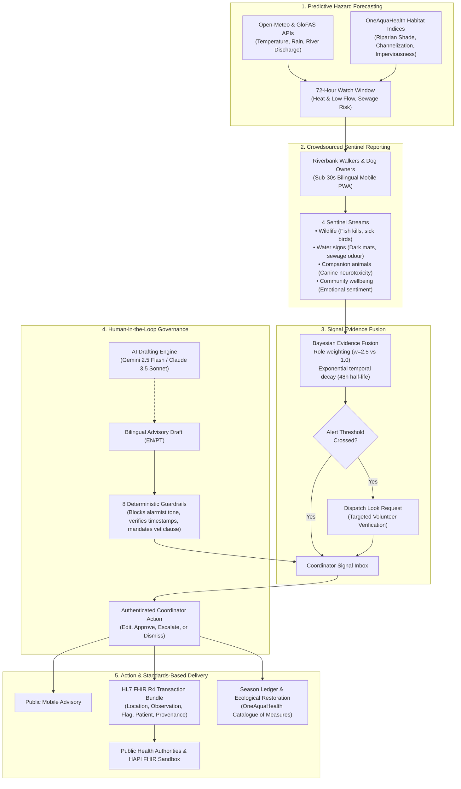
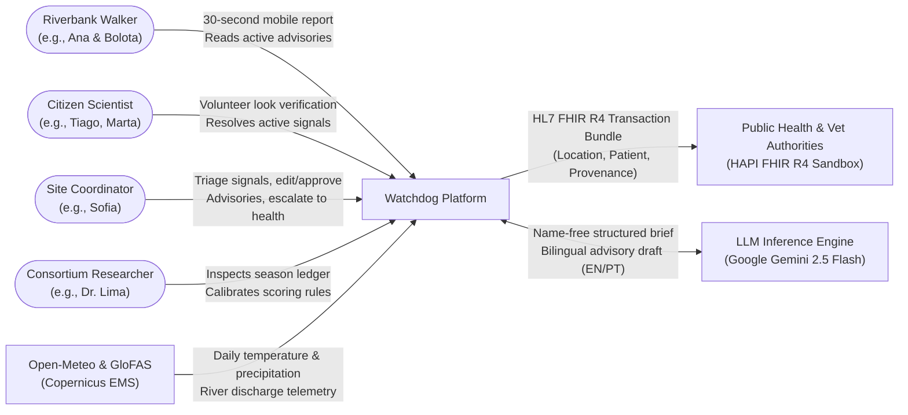
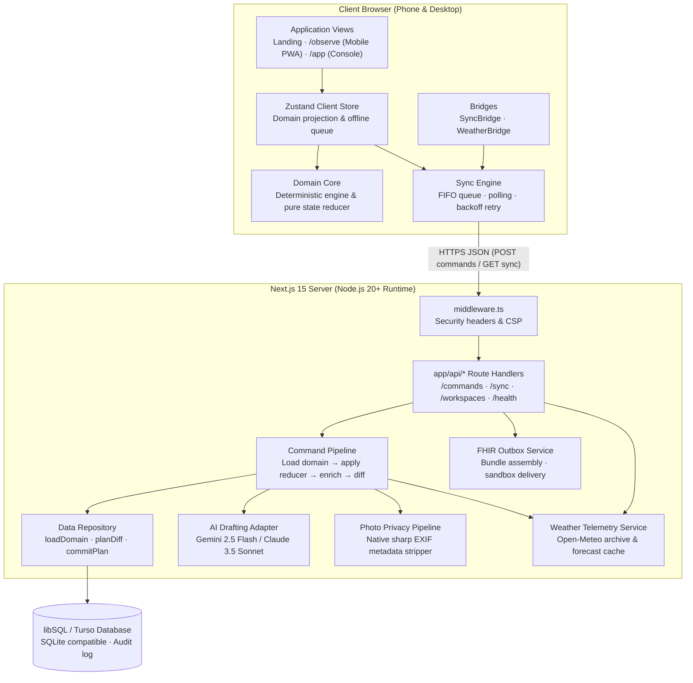
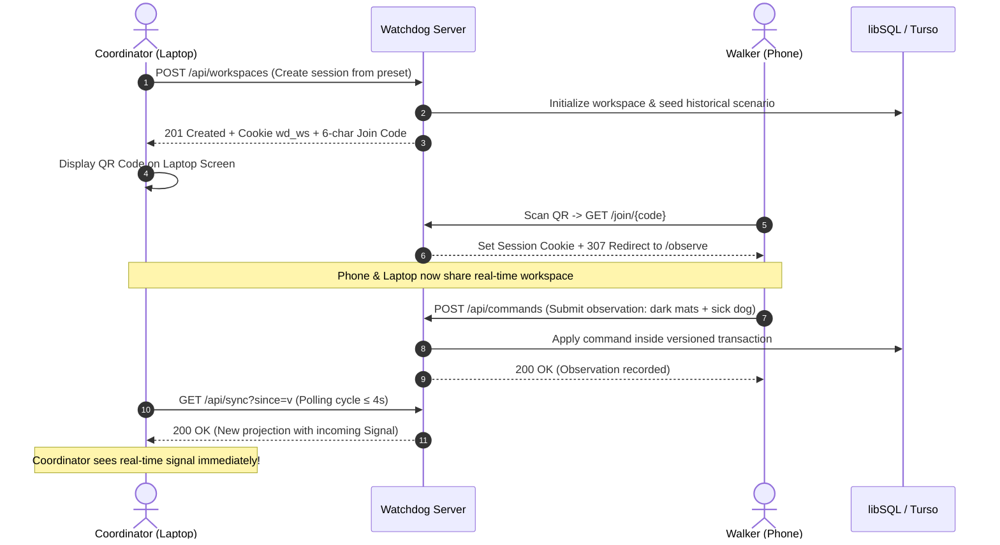
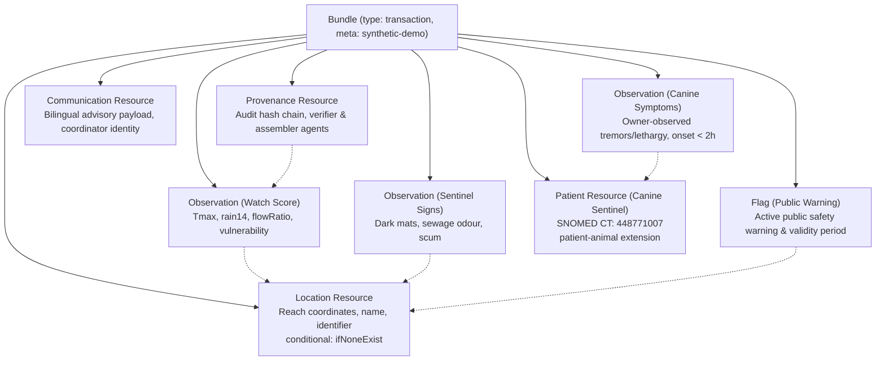
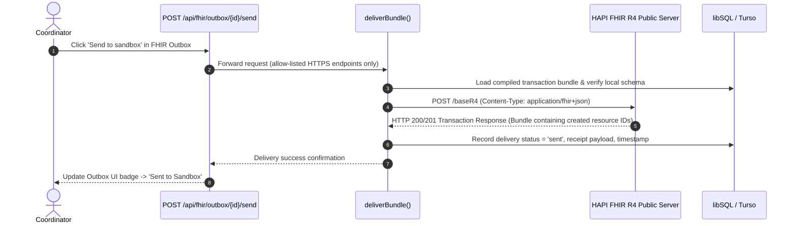
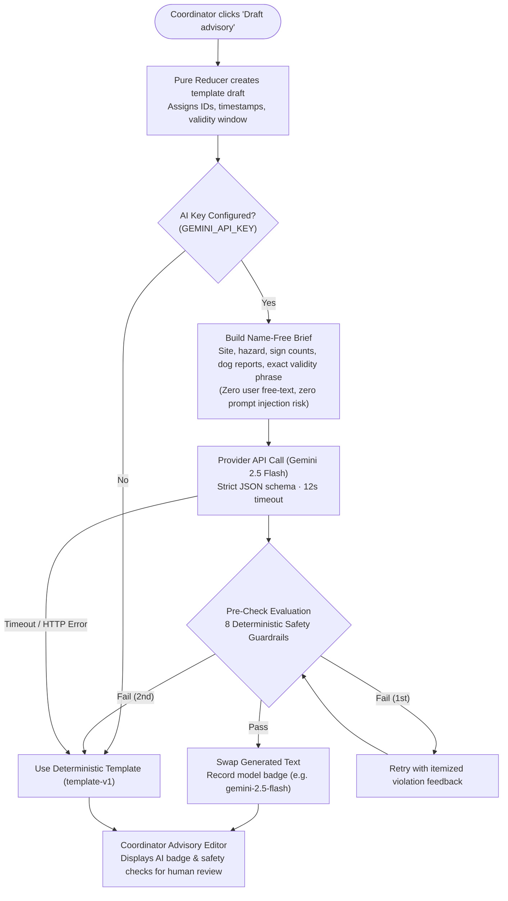
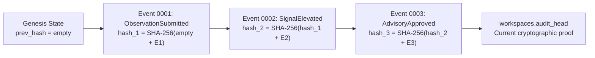

# Watchdog — One Health Environmental Early Warning for Urban Streams

[](https://www.typescriptlang.org/)
[](https://nextjs.org/)
[](https://react.dev/)
[-firebrick?logo=hl7)](https://hl7.org/fhir/R4/)
[](https://turso.tech/)
[](https://vitest.dev/)
[](https://playwright.dev/)
[](https://www.w3.org/WAI/WCAG21/quickref/)
[](LICENSE)

> **"The stream's early-warning system is already out walking."**  
> *Track 6: Resilience Informatics · OneAquaHealth IEEE Global Hackathon*

---

## Executive Summary

Urban streams represent the critical interface where city residents, companion animals, and wildlife encounter freshwater ecosystems. Across European metropolitan corridors, these small waterways face two severe, short-term biological hazards:

1. **Benthic cyanobacterial blooms** producing lethal neurotoxins (such as anatoxin-a) during warm, stagnant, low-flow drought periods.
2. **Untreated municipal sewage discharges** triggered by Combined Sewer Overflows (CSOs) during heavy rainfall events.

In narrow urban streams (often only 3 to 10 metres wide), satellite remote sensing cannot resolve water quality due to mixed-spectral noise and dense riparian canopy cover. Furthermore, traditional laboratory grab-sampling and bacterial culture analysis take days—far too slow to prevent acute intoxications. 

Canines routinely act as the primary biological sentinels for these hazards (*Hilborn & Beasley, 2015; Backer et al., 2013*): dogs swim in shallow edges, drink surface water, and ingest toxic shoreline mats. In August 2017, at least eight dogs died after swimming in the Loire river during extreme heat and low water; official warnings arrived only after the fatalities occurred.

**Watchdog exists so the warning arrives before exposure.** Grounded in the findings of the **OneAquaHealth Horizon Europe** research project (which identified pharmaceuticals at 91% of monitored stream sites and antimicrobial resistance in biofilms), Watchdog operationalizes a **One Health syndromic surveillance network**:

- **Forecasts** physical reach vulnerability 72 hours ahead using real meteorological and hydrological telemetry.
- **Empowers** daily riverbank walkers and their dogs to act as distributed biological sentinels via a sub-30-second, accountless mobile app.
- **Fuses** community sightings with reach vulnerability in an explainable, Bayesian evidence model.
- **Enforces** a strict human-in-the-loop coordinator gate with 8 deterministic safety guardrails before public alerts publish.
- **Delivers** atomic **HL7 FHIR R4** transaction bundles directly to municipal public health and veterinary authorities.
- **Closes the loop** with a Season Ledger mapping accumulated risk-days to nature-based restoration priorities in the OneAquaHealth Catalogue of Measures.

---

## Table of Contents

- [The Surveillance Loop](#the-surveillance-loop)
- [System Architecture & Design](#system-architecture--design)
  - [1. System Context & Actors (C4 Level 1)](#1-system-context--actors-c4-level-1)
  - [2. Container Architecture (C4 Level 2)](#2-container-architecture-c4-level-2)
  - [3. Multi-Device Real-Time Sync & QR Pairing](#3-multi-device-real-time-sync--qr-pairing)
- [HL7 FHIR R4 Interoperability](#hl7-fhir-r4-interoperability)
  - [Bundle Composition](#bundle-composition)
  - [Sandbox Transmission Sequence](#sandbox-transmission-sequence)
- [Responsible AI Drafting & Guardrails](#responsible-ai-drafting--guardrails)
- [Core Platform Capabilities](#core-platform-capabilities)
- [Mathematical Formulations](#mathematical-formulations)
- [Quickstart & Local Development](#quickstart--local-development)
- [The 4-Minute Golden Path](#the-4-minute-golden-path)
- [Testing & Quality Assurance](#testing--quality-assurance)
- [Data Honesty & Cryptographic Auditability](#data-honesty--cryptographic-auditability)
- [Repository Layout](#repository-layout)
- [References & Standards](#references--standards)

---

## The Surveillance Loop

Watchdog operates an auditable, closed-loop surveillance pipeline connecting environmental sensors, community sentinels, human triage, and health authorities:



---

## System Architecture & Design

Watchdog is built as an isomorphic full-stack TypeScript platform (99.2% TypeScript) with **zero runtime drift** between client-side simulation and centralized cloud execution.

### 1. System Context & Actors (C4 Level 1)

The system mediates between distinct community stakeholders, scientific consortiums, and automated municipal services:



| Actor / System | Role & Responsibility | Trust Boundary |
|---|---|---|
| **Walker** | Discovers streams, files 30s sentinel reports, reads advisories | Untrusted client input; Canvas EXIF stripping; weight ×1.0 |
| **Citizen Scientist** | Accepts targeted verification look requests, confirms signs | Verified contributor; weight ×2.5 |
| **Site Coordinator** | Reviews signals, requests looks, edits/approves advisories, escalates | Fully trusted; all actions recorded to cryptographic audit log |
| **Public Health Authorities** | Receives standardized clinical & veterinary alerts via FHIR R4 | External healthcare system; authenticated transaction bundles |
| **Open-Meteo & GloFAS** | Provides real-time weather and river discharge telemetry | Public REST APIs (CC BY 4.0; Copernicus EMS) |
| **LLM Provider (Gemini)** | Drafts bilingual advisory notices from structured briefs | Sandboxed processor; no access to user identities or raw text |

---

### 2. Container Architecture (C4 Level 2)

The application architecture decouples the browser runtime from the server API while sharing the exact same deterministic domain engine:



---

### 3. Multi-Device Real-Time Sync & QR Pairing

Watchdog allows instant field-to-console synchronization between a field phone and a laptop console without requiring users to register personal accounts:



---

## HL7 FHIR R4 Interoperability

When an advisory is authorized by a coordinator, Watchdog compiles an atomic **HL7 FHIR R4 Transaction Bundle** transmitted directly to health authority endpoints.

### Bundle Composition



- **Animal Patients in FHIR**: Complies with the official HL7 `patient-animal` extension (SNOMED CT `448771007` *Canis lupus familiaris*), treating animal illness as an environmental health signal rather than an afterthought.
- **Idempotent Public Server Delivery**: Solves public HAPI FHIR test server conflicts using `ifNoneExist` conditional create URLs across `Location`, `Patient`, and `Provenance` resources.
- **Cryptographic Auditability**: Every bundle embeds a SHA-256 hash chaining back to the coordinator's approval action and the specific engine rules version.

### Sandbox Transmission Sequence



---

## Responsible AI Drafting & Guardrails

Watchdog utilizes LLMs solely for bilingual phrasing acceleration—never for decision making or scoring. The drafting pipeline isolates the LLM from user text to prevent prompt injection and guarantees patient safety through 8 deterministic programmatic checks:



### The 8 Deterministic Safety Guardrails

| Guardrail | Enforcement Level | Rule Specification |
|---|---|---|
| **1. Completeness** | Blocking | Both English and Portuguese payloads must be $\ge 20$ characters. |
| **2. Non-Alarmist Tone** | Blocking | Forbids sensationalist terms (e.g., *deadly, lethal, catastrophe, toxic, panic*). |
| **3. Non-Diagnostic** | Blocking | Prohibits speculative diagnoses (e.g., *infection, poisoned, illness diagnosed*). |
| **4. No Safety Guarantees** | Blocking | Never claims water is "safe" or "cleared" (e.g., *safe, seguro, safe to drink*). |
| **5. Timestamp Verification** | Blocking | Must explicitly state the advisory expiration time matching the system window. |
| **6. Precautionary Phrasing** | Advisory | Must identify the notice as a *precaution* rather than a laboratory finding. |
| **7. Sentence Length** | Advisory | Hard ceiling of $< 20$ words per sentence for cognitive accessibility. |
| **8. Plain Language** | Advisory | Vocabulary target calibrated to CEFR B1 / Grade 8 reading comprehension level. |

---

## Core Platform Capabilities

| Capability | Technical Realization | User Benefit |
|---|---|---|
| **Predictive Watch Windows** | Ingests Open-Meteo weather and GloFAS river discharge, scaled by OneAquaHealth habitat surveys | Anticipates acute hazard vulnerability 72 hours before biological exposure occurs. |
| **30-Second Sentinel App** | Responsive mobile PWA (EN/PT) with large-text mode, high-contrast tokens, and icon clarity | Riverbank walkers report water signs or sick dogs in under 30 seconds with **zero account creation**. |
| **Privacy by Construction** | Dual-pass EXIF stripping (client HTML5 Canvas + server `sharp`), ephemeral session cookies | Walkers can submit photo evidence without leaking GPS coordinates of their homes or routes. Instant "Forget this device" data wipe. |
| **Signal Evidence Fusion** | Bayesian evidence aggregation with role weighting ($w_{\text{volunteer}}=2.5$, $w_{\text{public}}=1.0$) and exponential decay | Eliminates noise from isolated false alarms while rapidly elevating acute canine neurotoxicity reports. |
| **Responsible AI Drafting** | Provider-neutral LLM adapter (Gemini 2.5 Flash / Claude 3.5 Sonnet) constrained to strict JSON schemas | Accelerates bilingual advisory creation without hallucinating. Evaluated against **8 deterministic guardrails**. |
| **Human-in-the-Loop Gate** | Dedicated Coordinator Console with a comprehensive "Why Drawer" detailing every input, weight, and threshold | **Zero machine text publishes automatically.** A qualified human coordinator retains total editorial governance. |
| **Season Ledger & Restoration** | Aggregates seasonal risk-days and correlates root-cause habitat deficits (e.g., lack of riparian shade) | Directs municipal budgets toward nature-based solutions catalogued in the OneAquaHealth Catalogue of Measures. |

---

## Mathematical Formulations

### 1. Predictive Watch Formulation
A reach **Watch** quantifies physical hazard plausibility prior to biological symptom reports:

$$\text{Watch Score} = 100 \times T(\text{Weather}) \times V(s)$$

Where $T(\text{Weather}) \in [0, 1]$ models thermal stress, 14-day cumulative rainfall deficit, and discharge ratio anomalies:

$$T(\text{Weather}) = \text{clamp}\left(0.45 \cdot \frac{T_{\max} - 22}{14} + 0.35 \cdot \left(1 - \frac{R_{14}}{40}\right) + 0.20 \cdot \left(1 - \text{FlowRatio}\right)\right)$$

And $V(s) \in [0.2, 1.0]$ represents reach physical vulnerability derived from OneAquaHealth habitat parameters (shade deficit, channel modification, and catchment sealed surface fraction).

### 2. Evidence Fusion Formulation
Incoming field reports are fused into an evidentiary confidence score with exponential temporal decay:

$$\text{Evidence Score} = \min\left(100, \; \sum_{i} w_{\text{role}} \cdot s_{\text{sign}} \cdot e^{-\lambda \Delta t}\right)$$

- Verified volunteer accounts carry higher evidentiary weight ($w = 2.5$) than unverified public submissions ($w = 1.0$).
- Observations older than 48 hours decay to near-zero ($\lambda = 0.05/\text{hr}$).
- Acute canine neurotoxicity reports (onset under 2 hours) trigger immediate priority escalation.

---

## Quickstart & Local Development

### Prerequisites
- Node.js 20+ (Node.js 22 LTS recommended)
- npm 10+

### Installation & Run

```bash
# 1. Clone repository
git clone https://github.com/edish-github/Watchdog.git
cd Watchdog

# 2. Install dependencies
npm install

# 3. Start local development server (Local Mode)
npm run dev
# -> Accessible at http://localhost:3000
```

### Key Routes

| Route | Viewport | Target User | Description |
|---|---|---|---|
| `/` | Desktop / Tablet | All | Platform landing page & OneAquaHealth context |
| `/observe` | Mobile (390px) | Citizens & Walkers | Bilingual (EN/PT) sentinel reporting PWA |
| `/observe/sites/[id]`| Mobile | Citizens & Walkers | Reach forecast, active precautions, 30s report flow |
| `/app/overview` | Desktop | Site Coordinators | Real-time map, active watches, triage inboxes |
| `/app/signals/[id]` | Desktop | Site Coordinators | Evidence fusion detail & "Why Drawer" explanation |
| `/app/advisories` | Desktop | Site Coordinators | Bilingual advisory editor & safety guardrail checks |
| `/app/fhir` | Desktop | Public Health Liaisons | Live HL7 FHIR R4 outbox & sandbox transmission |
| `/app/ledger` | Desktop | Municipal Planners | Seasonal risk-days & ecological restoration measures |
| `/app/rules` | Desktop | Scientists & Auditors | Deterministic scoring rules & in-browser self-tests |

### Server & Remote Mode (Turso / libSQL)

To run Watchdog with multi-device synchronization backed by Turso / libSQL:

```bash
# Configure environment (optional, defaults to local SQLite file)
cp .env.example .env.local

# Run database smoke tests and migrations
npm run db:smoke

# Start in Remote Mode across LAN (allowing mobile QR code pairing)
COOKIE_SECURE=false NEXT_PUBLIC_BACKEND=remote npm start -- -H 0.0.0.0 -p 3000
```

---

## The 4-Minute Golden Path

To evaluate the full end-to-end One Health surveillance loop:

1. **Preset Selection**: Open the coordinator console top bar and select **Day 2 · 14:00** (replaying a historical Coimbra heatwave week).
2. **Citizen Sentinel Report**: Navigate to `/observe` on mobile (or mobile emulator). Select site **COI-03 (Parque Verde)**. Tap **Report** → select *Dark mats* + *My dog seems unwell* → select *Onset under 2 hours* → submit. A high-priority Signal opens immediately.
3. **Targeted Verification**: In the Coordinator Console (`/app/signals`), open the COI-03 Signal. Click **Request look** and assign volunteer Tiago. Switch to `/observe/requests` as Tiago, confirm presence of benthic mats, and submit verification.
4. **AI Drafting & Guardrails**: Click **Draft advisory**. The Gemini/Claude drafter generates bilingual text (EN/PT). View the 8 passing safety guardrails (verifying non-alarmist tone and mandatory veterinary contact clauses). Click **Approve and publish**.
5. **HL7 FHIR Sandbox Dispatch**: Navigate to `/app/fhir`. Inspect the compiled transaction bundle with the canine Patient resource. Click **Send to sandbox** to execute a live HTTP POST to the public HAPI FHIR R4 test server (`hapi.fhir.org/baseR4`).
6. **Resolution**: Advance the replay clock 24 hours. Dispatch two resolution check look requests; record "no signs" twice to automatically transition the advisory to **Resolved**.
7. **Ecological Restoration**: Navigate to `/app/ledger`. Observe how accumulated risk-days at COI-03 highlight missing riparian canopy shade, recommending vegetative buffer restoration from the OneAquaHealth Catalogue of Measures.

---

## Testing & Quality Assurance

Watchdog enforces rigorous quality assurance across unit, integration, end-to-end, and accessibility standards:

```bash
# 1. Run Vitest Unit & Integration Suites (94 tests)
npm run test:unit

# 2. TypeScript Static Typecheck
npm run typecheck

# 3. Playwright E2E Test Suite (25 routes + golden path)
npm run test:e2e

# 4. Live HAPI FHIR R4 Network Delivery Test
npm run test:e2e:network

# 5. Golden Path 10x Stability Verification
npx playwright test e2e/golden-path.spec.ts --repeat-each 10

# 6. Capture UI Review Screenshots
npm run capture:screenshots
```

### Verified Test Results

- **Unit & Integration**: **94 passing tests** across 11 suites covering reducer state machines, cryptographic audit chains, EXIF stripping, and AI draft fallbacks in **1.00s**.
- **End-to-End**: Automated Playwright verification of all 25 public and coordinator routes.
- **Accessibility**: **0 WCAG 2.1 AA violations** verified across all views using `@axe-core/playwright`.
- **FHIR Schema**: Validated with **0 errors** against the official HL7 FHIR Release 4 (v4.0.1) schemas.

---

## Data Honesty & Cryptographic Auditability

Watchdog is designed around strict transparency and bioethical principles:

1. **Precaution, Never Diagnosis**: Watchdog explicitly states: *"This is a community precaution, not a laboratory test result."* The platform never declares water "safe" or "toxic," and acute canine reports immediately direct owners to veterinary care.
2. **Clear Telemetry Labeling**: The demonstration platform replays a verified historical weather week from the Open-Meteo archive (Coimbra, Portugal). Replay status and synthetic community reports are explicitly badged on every screen.
3. **No Unlicensed Data Mining**: Watchdog does not scrape or republish restricted OneAquaHealth project databases; reach habitat survey structures mirror open project indicators as synthetic baselines pending formal consortium onboarding.
4. **Cryptographic Audit Hash Chain**: Every municipal state transition, advisory approval, and FHIR transmission appends to an immutable SHA-256 hash chain:



---

## Repository Layout

```
watchdog/
├── app/                                  # Next.js 15 App Router
│   ├── page.tsx                          # Landing page & OneAquaHealth context
│   ├── login/ · signup/                  # Staff authentication & walker sentinel profiles
│   ├── observe/                          # Mobile Sentinel PWA (EN/PT, 390px responsive)
│   │   ├── sites/[siteId]/               # Reach vulnerability, precautions, 30s report flow
│   │   └── observations/ · requests/     # Public feed & volunteer look requests
│   └── app/                              # Coordinator Console
│       ├── overview/ · sites/            # Real-time surveillance map & reach registries
│       ├── signals/ · verification/      # Bayesian evidence triage & look dispatches
│       ├── advisories/ · fhir/           # Advisory editor, guardrails, & FHIR outbox
│       └── ledger/ · rules/              # Season restoration ledger & rules auditor
├── components/                           # Reusable UI component library
│   ├── shell/                            # Desktop sidebar, topbar, & replay clock controls
│   ├── observe/                          # Mobile PWA shell, risk curves, & sign grids
│   └── console/                          # Why Drawer, advisory editor, & FHIR JSON viewer
├── docs/                                 # Architectural documentation & specifications
│   ├── ARCHITECTURE.md                   # Full system architecture specification
│   ├── DEPLOY.md                         # Vercel & Turso production deployment guide
│   └── screenshots/                      # 15 captured visual review screenshots
├── e2e/                                  # Playwright end-to-end testing suites
│   ├── golden-path.spec.ts               # Complete surveillance loop & 17 in-browser tests
│   ├── smoke.spec.ts                     # Route availability check for all 25 pages
│   ├── a11y.spec.ts                      # Automated WCAG 2.1 AA accessibility audit
│   └── network.spec.ts                   # Live public HAPI FHIR R4 sandbox delivery
├── lib/                                  # Isomorphic domain core
│   ├── engine.ts                         # Versioned deterministic scoring engine (v1.0.0)
│   ├── sim.ts                            # Pure reducer state machine & scenario replay
│   ├── advisory.ts                       # AI drafting prompt & 8 safety guardrails
│   ├── fhir.ts                           # HL7 FHIR R4 transaction bundle compiler
│   ├── weather.ts                        # Open-Meteo & GloFAS forecast ingestion
│   └── server/                           # Node.js backend pipeline (commands, db, sharp)
└── tests/                                # Vitest test suites (94 tests)
```

---

## References & Standards

1. **Hilborn, E. D., & Beasley, V. R. (2015).** One Health and Cyanobacteria in Freshwater Systems: Animal Illnesses and Deaths are Sentinel Events for Human Health Risks. *Toxins*, 7(4), 1374–1395.
2. **Backer, L. C., et al. (2013).** Canine Cyanotoxin Poisonings in the United States (1920s–2012): Review of Suspected and Confirmed Cases. *Toxins*, 5(9), 1597–1628.
3. **Bouma-Gregson, K., Kudela, R. M., & Power, M. E. (2018).** Widespread Anatoxin-a Detection in Benthic Cyanobacterial Mats Throughout a River Network. *PLoS ONE*, 13(5), e0197669.
4. **European Parliament & Council. (2024).** Directive (EU) 2024/3019 on Urban Wastewater Treatment (Recast).
5. **HL7 International.** HL7 FHIR Release 4 (v4.0.1): StructureDefinition `patient-animal` (SNOMED CT `448771007`).
6. **OneAquaHealth Consortium.** Horizon Europe Research Project (Grant Agreement No. 101086521): Citizen Science App, Environmental Surveillance System, and Catalogue of Measures.

---

## License

This project is licensed under the **Apache-2.0 License**. See [LICENSE](LICENSE) for details.
